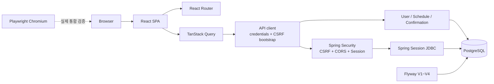

# CalTalk

CalTalk은 사용자 시간대를 기준으로 일정을 관리하고, 겹치는 일정은 확인 요청을 거쳐 저장하는 웹 애플리케이션입니다. 현재 로컬 Web MVP 핵심 흐름인 인증, 일정 CRUD, 시간대 변경, 충돌 확인과 실제 브라우저 E2E까지 구현했습니다.

**Web MVP Core Complete · Backend Portfolio PASS · Frontend Core Complete · Browser E2E Complete · Deployment Pending**

운영 배포, 자연어 일정 입력, OpenAI 및 카카오 연동은 아직 구현하지 않았습니다. 따라서 현재 상태를 production ready 또는 전체 서비스 완성으로 표현하지 않습니다.

## 구현 범위

### Backend

- 이메일 회원가입·로그인과 Google·카카오·네이버 간편 로그인, 로그아웃
- 현재 사용자 조회, 시간대 변경, 비밀번호 확인 후 회원 탈퇴
- 일정 생성, 기간 조회, 상세 조회, 수정, 삭제
- 일정 충돌 감지와 `CREATE_EVENT`·`UPDATE_EVENT` confirmation
- confirmation 승인, 5분 만료, stale snapshot 교체
- 일정 변경 이력과 optimistic locking
- PostgreSQL 기반 Spring Session JDBC
- 브라우저 CSRF, 제한된 CORS, strict JSON
- 부분 유니크 인덱스와 동시 요청 수렴

### Frontend

- React SPA와 React Router 기반 공개·보호 경로
- 회원가입, 로그인, 로그아웃, 새로고침 후 세션 복원
- `GET /api/v1/users/me`를 인증 상태의 source of truth로 사용
- 사용자 시간대 변경
- 일정 목록, 상세, 생성, 수정, 삭제
- location `KEEP`·`SET`·`REMOVE`
- 409 충돌 dialog, confirmation 승인, replacement confirmation 처리
- loading, empty, error 상태
- label과 dialog role을 사용한 접근성 기본 구조

### Browser E2E

- 실제 PostgreSQL 17과 Flyway V1~V4
- 실제 Spring Boot backend와 Vite frontend
- 실제 Playwright Chromium
- 회원가입, 중복 이메일, 정상·실패 로그인, 세션 복원
- `CALTALK_SESSION`, `XSRF-TOKEN`, `X-XSRF-TOKEN` 계약
- 일정 CRUD와 시간대 변경 후 UTC 값 불변
- CREATE_EVENT·UPDATE_EVENT confirmation 승인
- 로그아웃 후 이전 세션 재사용 `401`

## 기술 스택

| 영역 | 기술 |
|---|---|
| Frontend | React 19, TypeScript 5.9, Vite 8, React Router 8.3.0 |
| Client state/form | TanStack Query, React Hook Form, Zod |
| Frontend test | Vitest, Testing Library, Playwright 1.62.1 |
| Backend | Java 21, Spring Boot 4.0.7, Spring Web, Spring Security, Spring Data JPA |
| Session/security | Spring Session JDBC, Cookie CSRF, BCrypt |
| Database | PostgreSQL 17, Flyway V1~V4 |
| Infra | Docker Compose, Redis 7.4 |
| Quality | Gradle, ESLint, Prettier |

Redis 컨테이너는 향후 확장과 로컬 인프라 구성을 위해 준비되어 있습니다. 현재 인증 세션 저장소는 Redis가 아니라 PostgreSQL 기반 Spring Session JDBC입니다.

## 아키텍처



Frontend는 session cookie 값을 직접 읽거나 저장하지 않습니다. 인증 요청은 `credentials: include`를 사용하고, 상태 변경 전에 `GET /api/v1/csrf`로 발급된 `XSRF-TOKEN` 값을 `X-XSRF-TOKEN` 헤더로 전달합니다.

## 인증과 보안

- 로그인 성공 시 session ID를 교체하고 `CALTALK_SESSION`을 발급합니다.
- 인증 상태는 `SPRING_SESSION`과 `SPRING_SESSION_ATTRIBUTES`에 저장합니다.
- session timeout은 12시간입니다.
- 로그아웃과 회원 탈퇴는 현재 session을 무효화하고 삭제 cookie를 반환합니다.
- `CALTALK_SESSION`은 HttpOnly이며 로컬 HTTP에서는 Secure=false입니다.
- 운영 HTTPS에서는 `SESSION_COOKIE_SECURE=true`가 필요합니다.
- CSRF cookie는 `XSRF-TOKEN`, 요청 header는 `X-XSRF-TOKEN`입니다.
- 개발 CORS origin은 `http://localhost:5173` 하나만 허용합니다.
- 일정 소유권은 요청의 userId가 아니라 session principal로 판단합니다.
- 다른 사용자의 일정은 존재 여부를 노출하지 않도록 `404`로 처리합니다.
- 인증 정보를 localStorage나 sessionStorage에 저장하지 않습니다.

## 시간대와 일정 수정 계약

일정은 서버와 DB에서 UTC `Instant`로 저장합니다. 입력과 표시는 사용자의 IANA time zone을 기준으로 변환합니다. 시간대를 변경해도 저장된 UTC 값은 바뀌지 않습니다.

- 존재하지 않는 DST local time은 거부합니다.
- DST overlap은 두 후보 중 더 이른 instant를 선택합니다.
- 일정 수정에는 최신 `version`을 포함합니다.
- location을 바꾸지 않으면 필드를 생략하고, 설정은 문자열, 제거는 `null`을 보냅니다.

## 충돌과 confirmation

같은 사용자의 일정이 겹치면 즉시 저장하지 않고 `409 SCHEDULE_CONFLICT`와 `confirmationId`, 충돌 목록을 반환합니다. 사용자는 `POST /api/v1/confirmations/{id}/approve`로 승인합니다.

- 명령 유형: `CREATE_EVENT`, `UPDATE_EVENT`
- 주요 상태: `PENDING`, `CONSUMED`, `SUPERSEDED`, `EXPIRED`
- 만료: 발급 후 5분
- 재검증: candidate fingerprint, conflict snapshot, 수정 대상 version
- stale confirmation은 `SUPERSEDED`로 전환하고 최신 replacement confirmation을 제공합니다.
- frontend는 replacement 상태를 최대 3회 교체한 뒤 사용자가 최신 충돌을 다시 확인하도록 합니다.
- 결정적인 동시 경쟁은 backend 통합 테스트가 담당하고, E2E는 실제 사용자 승인 흐름을 담당합니다.

## 주요 API

| Method | Path | 인증 | CSRF | 성공 |
|---|---|---:|---:|---:|
| POST | `/api/v1/auth/signup` | 불필요 | 예외 | 201 |
| POST | `/api/v1/auth/login` | 불필요 | 예외 | 200 |
| POST | `/api/v1/auth/logout` | 선택 | 필요 | 204 |
| GET | `/api/v1/csrf` | 불필요 | 불필요 | 204 |
| GET | `/api/v1/users/me` | 필요 | 불필요 | 200 |
| PATCH | `/api/v1/users/me` | 필요 | 필요 | 200 |
| DELETE | `/api/v1/users/me` | 필요 | 필요 | 204 |
| POST | `/api/v1/schedules` | 필요 | 필요 | 201 |
| GET | `/api/v1/schedules` | 필요 | 불필요 | 200 |
| GET | `/api/v1/schedules/{id}` | 필요 | 불필요 | 200 |
| PATCH | `/api/v1/schedules/{id}` | 필요 | 필요 | 200 |
| DELETE | `/api/v1/schedules/{id}` | 필요 | 필요 | 204 |
| POST | `/api/v1/confirmations/{id}/approve` | 필요 | 필요 | 200 |
| GET | `/api/v1/health` | 불필요 | 불필요 | 200 |
| GET | `/actuator/health` | 불필요 | 불필요 | 200 |

## 로컬 실행

필수 도구는 Java 21, Node.js, npm, Docker Desktop입니다.

### 한 번에 실행하기 (권장)

저장소 루트에서 아래 명령을 실행하면 Docker Desktop, PostgreSQL, Redis, Ollama,
backend, frontend와 카카오 테스트용 HTTPS 터널을 순서대로 점검하고 꺼진 구성요소만 시작합니다.

```powershell
powershell -ExecutionPolicy Bypass -File .\scripts\start-local.ps1
```

카카오 스킬 URL을 클립보드에도 복사하려면 다음 옵션을 사용합니다.

```powershell
powershell -ExecutionPolicy Bypass -File .\scripts\start-local.ps1 -CopySkillUrl
```

마지막에 출력되는 `Kakao skill` 주소가 챗봇 관리자센터에 등록된 URL과 다르면
스킬의 `URL`·`Test URL`을 새 주소로 변경하고 저장·배포해야 합니다. Quick Tunnel은
로컬 개발용 임시 주소이므로 PC 또는 터널 재시작 후 변경될 수 있습니다.

### Backend와 인프라

```powershell
cd infra
Copy-Item .env.example .env
docker compose up -d

cd ..\backend
.\gradlew.bat bootRun
```

### Frontend

```powershell
cd frontend
npm install
npm run dev
```

Frontend는 `http://localhost:5173`, backend는 `http://localhost:8080`에서 실행합니다.

### 소셜 로그인 설정

OAuth 앱을 각 공급자 개발자 콘솔에서 만든 뒤 backend 실행 환경에 다음 값을 설정합니다. 하나 이상의 공급자에 `CLIENT_ID`와 `CLIENT_SECRET`이 모두 있어야 하며, 설정한 공급자만 로그인 화면에 표시됩니다.

```powershell
$env:SOCIAL_LOGIN_ENABLED='true'
$env:GOOGLE_CLIENT_ID='<client-id>'
$env:GOOGLE_CLIENT_SECRET='<client-secret>'
$env:KAKAO_CLIENT_ID='<rest-api-key>'
$env:KAKAO_CLIENT_SECRET='<client-secret>'
$env:NAVER_CLIENT_ID='<client-id>'
$env:NAVER_CLIENT_SECRET='<client-secret>'
$env:FRONTEND_ORIGIN='http://localhost:5173'
```

개발자 콘솔에 등록할 로컬 callback URI는 아래와 같습니다.

- Google: `http://localhost:8080/login/oauth2/code/google`
- 카카오: `http://localhost:8080/login/oauth2/code/kakao`
- 네이버: `http://localhost:8080/login/oauth2/code/naver`

운영 환경은 frontend의 공개 HTTPS origin을 사용합니다. 예를 들어 `https://caltalk.example.com/login/oauth2/code/google`처럼 등록하면 nginx가 callback을 backend로 전달합니다. 카카오는 `account_email`, Google은 `openid profile email`, 네이버는 이메일 정보 제공 동의를 활성화해야 합니다. 비밀키는 `.env`나 저장소에 커밋하지 말고 배포 환경의 secret 값으로 관리하세요.

## 검증 명령

### Backend

```powershell
cd backend
.\gradlew.bat clean test --console=plain
.\gradlew.bat compileTestJava --warning-mode all --console=plain
```

### Frontend

```powershell
cd frontend
npm audit
npm run format:check
npm run lint
npm run typecheck
npm run test -- --run
npm run build
```

### Browser E2E

```powershell
cd frontend
npm run e2e:install
npm run e2e
```

추가 명령:

- `npm run e2e:headed`: 브라우저를 표시하며 실행
- `npm run e2e:ui`: Playwright UI 실행
- `npm run e2e:full`: frontend 정적 검사, 단위 테스트, build와 E2E를 순서대로 실행

E2E orchestration은 PostgreSQL 55432, Redis 56379, backend 8080, frontend 5173을 사용합니다. Docker healthcheck와 Playwright `webServer` readiness를 사용하며 고정 sleep은 사용하지 않습니다. 실행 전에 이미 동작하던 Compose 서비스는 보존하고 이번 실행이 시작한 서비스만 정지합니다. `test-results`, `playwright-report`, `blob-report`는 Git에서 제외됩니다.

## 현재 검증 결과

기준 커밋 `d20e928`에서 확인한 결과입니다.

| 구분 | 결과 |
|---|---:|
| Backend tests | 96 / 96, 17 suites |
| Frontend unit/component tests | 30 / 30, 4 files |
| Playwright E2E | 5 / 5 |
| npm audit | 0 vulnerabilities |
| Backend warning-mode compile | 성공 |
| Frontend format/lint/typecheck/build | 성공 |
| Uncaught browser pageerror | 0 |

`pageerror`는 처리되지 않은 브라우저 런타임 예외를 뜻합니다. 의도적으로 검증하는 401·403·409 HTTP 응답은 브라우저 resource 메시지로 나타날 수 있으므로 console 메시지 전체가 없었다고 표현하지 않습니다.

## 현재 제한사항

- 운영 배포 URL과 HTTPS 검증이 없습니다.
- 운영 CORS와 Secure cookie 검증이 남아 있습니다.
- CI/CD, monitoring, alerting, backup/recovery가 구성되지 않았습니다.
- rate limiting과 로그인 시도 제한이 구현되지 않았습니다.
- 자연어 일정 입력과 OpenAI 연동이 구현되지 않았습니다.
- 카카오톡 채널·챗봇 연동은 구현되지 않았습니다. 카카오 계정 로그인과는 별도 범위입니다.
- confirmation 취소 API가 구현되지 않았습니다.
- 반복 일정과 알림이 구현되지 않았습니다.

## 로드맵

1. HTTPS, 운영 CORS, Secure cookie를 포함한 운영 배포
2. CI/CD, monitoring, alerting, PostgreSQL backup/recovery
3. rate limiting과 로그인 보호 강화
4. structured output 기반 자연어 일정 입력과 OpenAI 연동
5. pending command와 idempotency
6. 카카오 계정·채널 연동
7. confirmation 취소, 반복 일정과 알림

## 포트폴리오 문서

- [백엔드 아키텍처](docs/portfolio/BACKEND_ARCHITECTURE.md)
- [보안 및 세션](docs/portfolio/SECURITY_AND_SESSION.md)
- [동시성과 confirmation](docs/portfolio/CONCURRENCY_AND_CONFIRMATION.md)
- [Frontend와 Browser E2E](docs/portfolio/FRONTEND_AND_E2E.md)
- [UI/UX 전면 재설계](docs/portfolio/UI_UX_REDESIGN.md)
- [테스트 전략](docs/portfolio/TEST_STRATEGY.md)
- [개발 로드맵](docs/portfolio/ROADMAP.md)
- [배포 준비](docs/portfolio/DEPLOYMENT.md)
- [Render 배포 가이드](docs/portfolio/RENDER_DEPLOYMENT.md)

## 배포 및 화면 자료

- 배포 URL: 준비 중
- 사용자 화면 이미지: 실제 배포 화면 캡처 추가 예정
- 아키텍처: 위 Mermaid diagram 제공
- E2E 결과: 실행 명령과 현재 수치 제공
