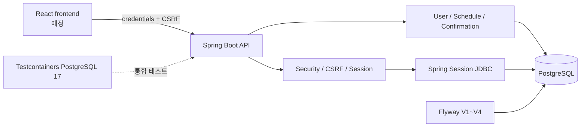
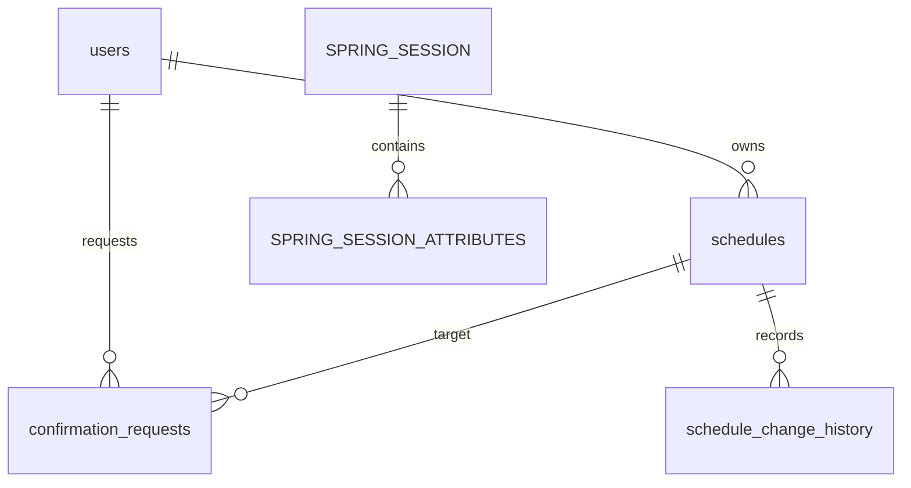

# CalTalk

CalTalk는 대화형 일정 관리 서비스를 목표로 하는 개인 프로젝트입니다. 현재는 회원 인증, 사용자 설정, 일정 CRUD, 일정 충돌 확인과 승인까지 백엔드로 구현했습니다. React 사용자 화면, 자연어 채팅, OpenAI 및 카카오 연동은 후속 단계입니다.

## 핵심 문제와 해결 방향

일정 충돌은 단순한 덮어쓰기로 처리하지 않습니다. 생성·수정 후보와 현재 충돌 상태를 confirmation으로 저장하고, 사용자가 승인하는 시점에 대상 버전과 충돌 목록을 다시 검증합니다. 동시에 같은 요청이 들어오면 PostgreSQL 제약과 잠금을 이용해 하나의 최신 confirmation으로 수렴시킵니다.

브라우저 인증은 서버 세션을 사용합니다. 인증 상태는 PostgreSQL의 Spring Session JDBC에 저장하며, 쿠키 기반 CSRF 계약과 제한된 CORS 정책을 함께 적용합니다.

## 현재 구현 상태

**Stage 10 Backend Complete · Backend Portfolio PASS · Frontend implementation pending**

구현 완료:

- 회원가입, 로그인, 로그아웃
- 현재 사용자 조회, 시간대 변경, 회원 탈퇴
- 일정 생성, 기간 목록 조회, 상세 조회, 수정, 삭제
- 일정 충돌 감지와 `CREATE_EVENT`·`UPDATE_EVENT` confirmation
- confirmation 승인, 5분 만료, 상태 전이
- 일정 변경 이력과 optimistic locking
- Spring Session JDBC와 브라우저 CSRF 계약
- 제한된 CORS, strict JSON, 소유권 은닉
- 동일 confirmation 동시 생성과 stale snapshot 수렴

현재 범위 밖:

- React 사용자 화면과 브라우저 E2E
- 자연어 일정 입력과 OpenAI 연동
- 카카오 계정·채널 연동
- confirmation 취소 API
- 운영 배포, CI/CD, 모니터링과 백업 정책

## 주요 기능

| 영역 | 현재 제공 기능 |
|---|---|
| 인증 | 이메일 회원가입, 로그인, 로그아웃, JDBC 세션 |
| 사용자 | 현재 사용자 조회, 시간대 변경, 비밀번호 재확인 후 탈퇴 |
| 일정 | UTC 기반 생성·조회·수정·삭제, 소유권 검증, 변경 이력 |
| 충돌 확인 | 충돌 후보 발급, 승인 시 재검증, 대체 confirmation 발급 |
| 오류 계약 | JSON 오류 응답, strict JSON, 검증 오류 필드 제공 |

## 핵심 기술

| 구분 | 기술 |
|---|---|
| Backend | Java 21, Spring Boot 4.0.7, Spring Web, Spring Security, Spring Data JPA, Spring Session JDBC |
| Database | PostgreSQL, Flyway V1~V4 |
| Build | Gradle Wrapper |
| Testing | JUnit 5, Spring Boot Test, MockMvc, Java HttpClient, PostgreSQL 17 Testcontainers |
| Infra | Docker Compose, PostgreSQL 17, Redis 7.4 |

Redis 의존성과 로컬 컨테이너는 준비되어 있지만 현재 핵심 세션 저장소는 Redis가 아니라 PostgreSQL 기반 Spring Session JDBC입니다.

## 시스템 아키텍처



애플리케이션은 Controller–Service–Repository 계층으로 구성합니다. 도메인 데이터와 세션 데이터는 같은 PostgreSQL 인스턴스의 분리된 테이블에 저장하고, Flyway가 스키마를 관리합니다.

## 인증·보안

- 로그인 성공 시 `CALTALK_SESSION`을 발급하고 session ID를 교체합니다.
- 인증 상태는 `SPRING_SESSION`과 `SPRING_SESSION_ATTRIBUTES`에 저장하며 유휴 만료는 12시간입니다.
- 로그아웃과 회원 탈퇴는 현재 요청의 세션을 제거합니다. 다른 사용자 세션은 유지합니다.
- `CookieCsrfTokenRepository`가 `XSRF-TOKEN` 쿠키와 `X-XSRF-TOKEN` 헤더를 사용합니다.
- 개발 CORS origin은 `http://localhost:5173`만 허용하며 credentials를 허용합니다.
- 일정 소유권은 요청의 사용자 ID가 아니라 session principal로 결정합니다.
- 다른 사용자의 일정은 존재 여부를 드러내지 않도록 `404`로 처리합니다.
- 비밀번호는 BCrypt hash로만 저장합니다.
- 요청 DTO의 알 수 없는 JSON 필드는 `422 UNKNOWN_FIELD`로 거부합니다.
- 비밀번호, hash, token, session ID와 내부 stack trace를 API 응답에 포함하지 않습니다.

### 브라우저 CSRF 요청 예시

회원가입과 로그인은 현재 CSRF 예외입니다. 로그인 전 또는 로그인 후 다음 bootstrap을 수행하고, 이후 상태 변경 요청에는 credentials와 CSRF 헤더를 함께 보냅니다.

```javascript
await fetch("http://localhost:8080/api/v1/csrf", {
  credentials: "include",
});

const csrfToken = document.cookie
  .split("; ")
  .find((value) => value.startsWith("XSRF-TOKEN="))
  ?.split("=")[1];

await fetch("http://localhost:8080/api/v1/users/me", {
  method: "PATCH",
  credentials: "include",
  headers: {
    "Content-Type": "application/json",
    "X-XSRF-TOKEN": decodeURIComponent(csrfToken ?? ""),
  },
  body: JSON.stringify({ timezone: "Asia/Seoul" }),
});
```

## 일정 충돌과 confirmation

일정 생성·수정 시 같은 사용자의 기존 일정과 시간이 겹치면 즉시 저장하지 않고 `409 SCHEDULE_CONFLICT`와 `confirmationId`를 반환합니다. 사용자는 `POST /api/v1/confirmations/{id}/approve`로 충돌을 인지했음을 전달한 뒤 저장할 수 있습니다.

- 명령 유형: `CREATE_EVENT`, `UPDATE_EVENT`
- 주요 상태: `PENDING`, `CONSUMED`, `SUPERSEDED`
- 만료: 발급 후 5분
- 재검증 정보: candidate fingerprint, conflict snapshot hash, target schedule version
- 승인 전에 충돌 목록이나 대상 버전이 바뀌면 기존 요청을 `SUPERSEDED`로 전환하고 최신 replacement confirmation을 제공합니다.

## 동시성 처리

- `schedules.version`과 JPA `@Version`으로 낙관적 잠금을 적용합니다.
- PENDING confirmation은 `(user_id, candidate_fingerprint) WHERE status = 'PENDING'` 부분 유니크 인덱스로 중복을 제한합니다.
- 최초 삽입은 PostgreSQL `ON CONFLICT DO NOTHING RETURNING`을 사용합니다.
- 충돌한 요청은 기존 PENDING 행을 비관적 잠금으로 읽고 최신 DB snapshot을 다시 계산합니다.
- stale 요청은 `SUPERSEDED`로 전환하며 replacement PENDING은 하나만 유지합니다.
- 재수렴은 최대 3회로 제한하고, 두 동시 요청은 최신 confirmation ID로 수렴합니다.
- 일정·이력·confirmation 상태 변경을 트랜잭션으로 묶어 부분 커밋을 방지합니다.

## API 요약

`CSRF` 열은 브라우저가 상태 변경 요청에 토큰을 제출해야 하는지를 나타냅니다.

| Method | Path | 인증 | CSRF | 성공 | 설명 |
|---|---|---:|---:|---:|---|
| POST | `/api/v1/auth/signup` | 불필요 | 예외 | 201 | 회원가입 |
| POST | `/api/v1/auth/login` | 불필요 | 예외 | 200 | 로그인과 세션 생성 |
| POST | `/api/v1/auth/logout` | 선택 | 필요 | 204 | 현재 세션 멱등 종료 |
| GET | `/api/v1/csrf` | 불필요 | 불필요 | 204 | CSRF 쿠키 발급 |
| GET | `/api/v1/users/me` | 필요 | 불필요 | 200 | 현재 사용자 조회 |
| PATCH | `/api/v1/users/me` | 필요 | 필요 | 200 | 시간대 변경 |
| DELETE | `/api/v1/users/me` | 필요 | 필요 | 204 | 회원 탈퇴 |
| POST | `/api/v1/schedules` | 필요 | 필요 | 201 | 일정 생성 |
| GET | `/api/v1/schedules` | 필요 | 불필요 | 200 | 기간 내 일정 목록 |
| GET | `/api/v1/schedules/{id}` | 필요 | 불필요 | 200 | 일정 상세 |
| PATCH | `/api/v1/schedules/{id}` | 필요 | 필요 | 200 | 일정 수정 |
| DELETE | `/api/v1/schedules/{id}` | 필요 | 필요 | 204 | 일정 삭제 |
| POST | `/api/v1/confirmations/{id}/approve` | 필요 | 필요 | 200 | 충돌 confirmation 승인 |
| GET | `/api/v1/health` | 불필요 | 불필요 | 200 | 애플리케이션 health |
| GET | `/actuator/health` | 불필요 | 불필요 | 200 | Actuator health |

## DB 구조

주요 테이블은 `users`, `schedules`, `confirmation_requests`, `schedule_change_history`, `SPRING_SESSION`, `SPRING_SESSION_ATTRIBUTES`입니다.



일정 삭제 시 `schedule_change_history`는 FK `ON DELETE CASCADE`로 삭제됩니다. Spring Session 삭제 시 attributes도 같은 방식으로 정리됩니다. 다른 도메인 FK는 명시적으로 필요한 순서에 따라 애플리케이션이 삭제합니다.

## 테스트 전략

기준 커밋 `17ef45b`의 현재 결과는 **96개 테스트, 17개 스위트, 실패 0, 오류 0, 건너뜀 0**입니다.

- PostgreSQL 17 Testcontainers 사용, H2 미사용
- 실제 Flyway V1~V4 migration 적용
- MockMvc 기반 API·오류·소유권 테스트
- Java HttpClient와 CookieManager 기반 실제 HTTP 브라우저 CSRF 흐름
- JDBC Session 저장·인증 복원·현재 세션 삭제 검증
- 일정 CRUD와 변경 이력, strict JSON, confirmation 상태 전이 검증
- CREATE/UPDATE 동시 경쟁과 부분 커밋 방지 검증

```powershell
cd backend
.\gradlew.bat clean test --console=plain
.\gradlew.bat compileTestJava --warning-mode all --console=plain
```

## 로컬 실행 방법

필수 도구는 Java 21과 Docker Desktop입니다. 저장소 루트에서 다음 순서로 실행합니다.

```powershell
cd infra
Copy-Item .env.example .env
docker compose up -d

cd ..\backend
.\gradlew.bat bootRun
```

`infra/compose.yaml`은 `postgres`와 `redis` 서비스를 실행합니다. `.env`는 Git 추적 대상이 아닙니다. `.env.example`의 값은 로컬 개발 편의를 위한 예시이며 운영에서 재사용하지 않습니다.

health 확인:

```powershell
Invoke-RestMethod http://localhost:8080/api/v1/health
Invoke-RestMethod http://localhost:8080/actuator/health
```

## 환경 변수

| 변수 | 역할 | 로컬 예시 | 운영 주의사항 | 필수 여부 |
|---|---|---|---|---|
| `DB_URL` | Backend PostgreSQL JDBC URL | `jdbc:postgresql://localhost:5432/caltalk` | 운영 DB 주소를 외부 주입 | 기본값 있음 |
| `DB_USERNAME` | Backend DB 사용자 | `caltalk` | 최소 권한 계정 사용 | 기본값 있음 |
| `DB_PASSWORD` | Backend DB 인증값 | 로컬 개발값 | 비밀 저장소에서 외부 주입 | 기본값 있음 |
| `SESSION_COOKIE_SECURE` | 세션·CSRF 쿠키 Secure 속성 | `false` | HTTPS 운영에서는 `true` | 기본값 있음 |
| `REDIS_HOST` | Redis 호스트 | `localhost` | 현재 핵심 세션 저장소가 아님 | 기본값 있음 |
| `REDIS_PORT` | Backend Redis 포트 | `6379` | 배포 환경 포트 사용 | 기본값 있음 |
| `POSTGRES_DB` | Compose PostgreSQL DB 이름 | `caltalk` | 운영 구성과 분리 | Compose `.env` 필요 |
| `POSTGRES_USER` | Compose PostgreSQL 사용자 | `caltalk` | 운영 최소 권한 계정과 분리 | Compose `.env` 필요 |
| `POSTGRES_PASSWORD` | Compose PostgreSQL 인증값 | 로컬 개발값 | 운영에서 새 값 외부 주입 | Compose `.env` 필요 |
| `POSTGRES_PORT` | Compose PostgreSQL 공개 포트 | `5432` | 외부 공개 범위 제한 | 예시값 있음 |
| `REDIS_PORT` | Compose Redis 공개 포트 | `6379` | 외부 공개 범위 제한 | 예시값 있음 |

CORS origin은 현재 환경 변수가 아니라 코드에서 `http://localhost:5173`으로 제한합니다. 운영 frontend를 배포할 때 실제 origin에 맞는 설정 방식으로 교체해야 합니다.

## 현재 제한사항

- React frontend와 브라우저 E2E는 아직 구현하지 않았습니다.
- 운영 배포, HTTPS, 운영 CORS 구성은 아직 적용하지 않았습니다.
- 자연어 일정 해석, OpenAI 연동, 카카오 연동은 후속 범위입니다.
- confirmation 취소 API는 현재 제공하지 않습니다.
- Redis는 의존성과 로컬 인프라만 준비되어 있으며 핵심 저장 경로로 사용하지 않습니다.
- CI/CD, 모니터링, alerting, 운영 백업 정책은 아직 구성하지 않았습니다.

## 향후 로드맵

1. React 화면에서 로그인, CSRF bootstrap, 일정 CRUD와 confirmation 승인을 연결합니다.
2. 실제 브라우저 E2E로 로그인부터 로그아웃까지 검증합니다.
3. HTTPS, Secure cookie, 운영 CORS와 외부 PostgreSQL을 구성합니다.
4. OpenAI structured output 기반 자연어 일정 후보와 idempotency를 설계합니다.
5. 카카오 연결과 요청 수신 방식을 검증합니다.
6. rate limiting, monitoring, alerting, backup과 CI/CD를 추가합니다.

상세 단계와 완료 기준은 아래 문서 목록의 개발 로드맵에 정리했습니다.

## 문서

- [백엔드 아키텍처](docs/portfolio/BACKEND_ARCHITECTURE.md)
- [보안 및 세션](docs/portfolio/SECURITY_AND_SESSION.md)
- [동시성 및 confirmation](docs/portfolio/CONCURRENCY_AND_CONFIRMATION.md)
- [테스트 전략](docs/portfolio/TEST_STRATEGY.md)
- [개발 로드맵](docs/portfolio/ROADMAP.md)
- [기술 설계서](docs/architecture/CalTalk_기술_설계서_v1.0.md)
- [화면·기능 명세서](docs/specification/CalTalk_화면_기능_명세서_v1.0.md)

## 배포 및 화면 자료

- 배포 URL: 준비 중
- API 문서 또는 health 확인 이미지: 추후 추가
- 사용자 화면 이미지: React frontend 구현 후 추가
- 아키텍처 다이어그램: 현재 README Mermaid 제공
