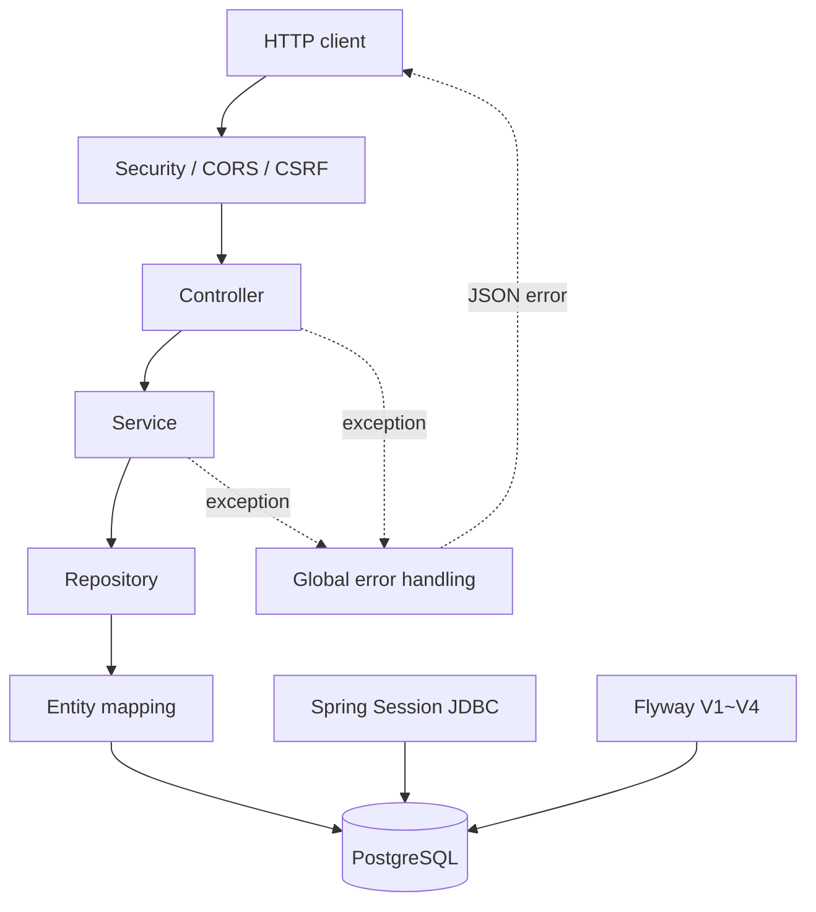
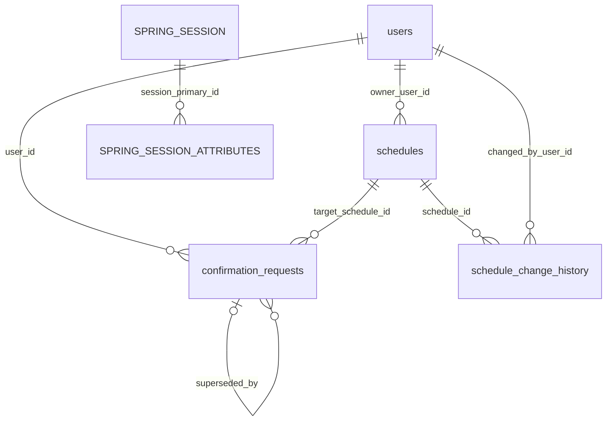

# 백엔드 아키텍처

## 목표와 현재 범위

CalTalk 백엔드는 대화형 일정 관리 서비스의 서버 기반을 제공한다. 현재 범위는 인증, 사용자 시간대, 일정 CRUD, 충돌 confirmation과 변경 이력이다. 자연어 해석, 카카오 연결, React 화면은 이 경계 밖에 있다.

## 계층 구조

- Controller는 HTTP 경로, 요청 검증, 상태 코드와 `Cache-Control`을 담당한다.
- Service는 현재 사용자 확인, 충돌 규칙, 상태 전이와 트랜잭션 경계를 담당한다.
- Repository는 JPA 조회, 잠금, 명시적 bulk delete와 native SQL 삽입을 담당한다.
- Entity는 DB 제약과 대응하는 도메인 상태 및 관계를 표현한다.
- Config는 Security, CORS, CSRF, Jackson strict JSON을 구성한다.
- 공통 오류 처리는 도메인·검증·보안 예외를 일관된 JSON으로 변환한다.

## 주요 도메인

### User

정규화된 이메일, BCrypt password hash, IANA timezone과 생성 시각을 저장한다. API는 principal의 이메일로 현재 사용자를 다시 조회하며 요청 본문의 사용자 식별값을 신뢰하지 않는다.

### Schedule

사용자 소유 일정의 제목, UTC 시작·종료 시각, 선택적 장소, version과 생성·수정 시각을 저장한다. `@Version`은 직접 수정과 confirmation 승인 사이의 경쟁을 감지한다.

### Confirmation

충돌이 있는 생성·수정 후보를 5분 동안 보존한다. 후보 fingerprint, 충돌 snapshot hash, UPDATE 대상 ID와 version으로 승인 시점의 유효성을 재검증한다.

### Schedule change history

CREATE와 UPDATE의 before/after 정보를 일정 및 변경 사용자와 함께 기록한다. 일정 삭제 시 FK CASCADE로 이력이 함께 삭제되며 DELETE 이력을 새로 만들지 않는다.

### Session

Spring Security의 인증 context를 Spring Session JDBC가 PostgreSQL에 저장한다. 애플리케이션은 세션 테이블을 직접 도메인 모델로 다루지 않는다.

## 요청 처리 흐름

1. Security filter가 CORS, 세션 인증과 CSRF를 검사한다.
2. Controller가 JSON을 DTO로 변환하고 Bean Validation을 수행한다.
3. Service가 session principal에 해당하는 사용자를 조회한다.
4. 일정 요청은 소유권, version, 시간 범위와 충돌을 확인한다.
5. 충돌이 없으면 일정과 이력을 저장한다. 충돌이 있으면 일정은 저장하지 않고 confirmation을 생성한다.
6. Controller가 성공 DTO 또는 공통 오류 JSON을 반환한다.

## 트랜잭션 경계

- 회원가입의 사용자 생성은 단일 트랜잭션이다.
- 일정 생성과 CREATE 이력 저장은 함께 커밋하거나 롤백한다.
- 일정 수정과 UPDATE 이력 저장도 같은 원칙을 적용한다.
- confirmation 승인은 행 잠금, 최신 상태 재검증, 일정·이력 저장과 상태 변경을 하나의 트랜잭션에서 처리한다.
- 회원 탈퇴는 confirmation, 일정, 이력 CASCADE와 사용자를 DB 트랜잭션으로 삭제한 뒤 HTTP 세션을 정리한다.
- 충돌 응답에 필요한 PENDING confirmation은 예외 응답에도 보존해야 하므로 해당 예외를 rollback 대상에서 제외한다.

## PostgreSQL을 사용하는 이유

운영 DB와 테스트 DB를 동일하게 유지하고, timestamp with time zone, 부분 유니크 인덱스, `ON CONFLICT ... RETURNING`, 행 잠금과 FK 제약을 실제 동작으로 검증하기 위해 PostgreSQL을 사용한다. 이 기능에 의존하므로 H2 대체 테스트를 두지 않는다.

## Flyway migration

| Version | 역할 |
|---|---|
| V1 | 초기 schema metadata |
| V2 | `users`와 이메일 unique 제약 |
| V3 | `schedules`, `confirmation_requests`, `schedule_change_history`, 인덱스와 CHECK/FK |
| V4 | `SPRING_SESSION`, `SPRING_SESSION_ATTRIBUTES`와 공식 인덱스/FK |

Hibernate는 schema를 생성하지 않고 `ddl-auto=validate`로 mapping을 검증한다. Spring Session의 자동 schema 초기화도 비활성화되어 있다.

## 주요 테이블 관계

이력과 Spring Session attributes만 부모 삭제 시 DB CASCADE를 사용한다. 사용자 탈퇴는 confirmation의 self reference와 일정 FK 순서를 고려해 애플리케이션에서 명시적으로 삭제한다.

## 현재 경계

현재 코드에는 자연어 parser, LLM adapter, pending command, idempotency record, 카카오 사용자 연결, notification, frontend가 없다. Redis starter와 로컬 컨테이너는 준비되어 있지만 현재 세션과 도메인 상태는 PostgreSQL에 저장한다.
