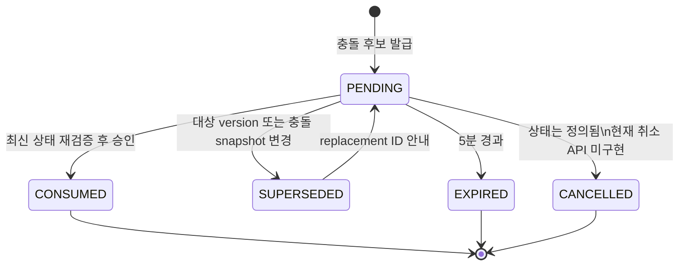

# 동시성 및 confirmation

## 충돌을 바로 덮어쓰지 않는 이유

일정 시간이 겹쳤다는 이유만으로 기존 일정을 수정하거나 새 일정을 무조건 거부하면 사용자의 의도를 보존하기 어렵다. CalTalk는 충돌 후보를 별도 confirmation으로 저장하고 사용자가 충돌을 확인한 뒤 승인하도록 한다. 승인 시점에는 DB 상태가 달라질 수 있으므로 후보의 유효성을 다시 검사한다.

## 충돌 응답과 후보

`POST /api/v1/schedules` 또는 `PATCH /api/v1/schedules/{id}`에서 같은 사용자 일정과 시간이 겹치면 일정과 이력을 저장하지 않는다. 대신 `409 SCHEDULE_CONFLICT`, `confirmationId`, 정렬된 충돌 목록을 반환한다.

- `CREATE_EVENT`: 새 일정 생성 후보
- `UPDATE_EVENT`: 기존 일정 수정 후보
- 만료: 생성 후 5분
- candidate fingerprint: 같은 사용자·명령·후보를 식별
- conflict snapshot hash: 충돌 일정 ID와 version의 snapshot
- target schedule version: UPDATE 대상이 발급 이후 바뀌었는지 검증

## 상태 전이



현재 공개 API가 직접 만드는 주요 상태는 PENDING, CONSUMED, SUPERSEDED다. CANCELLED는 schema와 도메인 상태에는 존재하지만 취소 endpoint는 구현하지 않았다.

## 승인 처리

승인은 confirmation 행을 비관적 잠금으로 읽고 다음을 검사한다.

1. 현재 사용자 소유인지 확인한다.
2. PENDING 상태와 5분 만료를 확인한다.
3. 충돌 인지 값이 true인지 확인한다.
4. UPDATE라면 대상 일정의 존재와 version을 확인한다.
5. 현재 DB에서 충돌 snapshot을 다시 계산한다.
6. 저장된 후보가 최신이면 일정과 변경 이력을 저장하고 CONSUMED로 전환한다.
7. snapshot 또는 version이 달라졌으면 기존 요청을 SUPERSEDED로 바꾸고 최신 replacement를 반환한다.

대상 일정이 삭제되어 UPDATE 후보를 재구성할 수 없으면 `CONFIRMATION_TARGET_GONE`으로 처리한다.

## 중복 PENDING 제한

PostgreSQL에는 다음 의미의 부분 유니크 인덱스가 있다.

```sql
(user_id, candidate_fingerprint) WHERE status = 'PENDING'
```

같은 사용자의 동일 후보가 동시에 최초 생성되어도 PENDING 행을 하나만 허용한다. 삽입은 native `ON CONFLICT DO NOTHING RETURNING`을 사용하므로 한 요청은 새 ID를 얻고 다른 요청은 충돌을 정상적인 수렴 신호로 처리한다.

## 경쟁 수렴 절차

삽입 충돌을 받은 요청은 기존 PENDING을 비관적 잠금으로 읽는다.

- 기존 fingerprint와 최신 snapshot/version이 같으면 기존 confirmation ID를 반환한다.
- 기존 PENDING이 stale이면 최신 DB 상태를 다시 계산한다.
- stale 행이 부분 유니크 인덱스를 점유하지 않도록 상태를 변경한다.
- 최신 후보로 replacement PENDING을 만들고 기존 행을 SUPERSEDED로 연결한다.
- 경쟁이 다시 발생하면 같은 절차를 최대 3회 수행한다.

이 방식은 무제한 retry를 피하면서 두 동시 요청이 하나의 최신 confirmation ID로 수렴하도록 한다.

## CREATE 경쟁 시나리오

### 최초 동일 후보 생성

두 요청이 동시에 같은 충돌 일정을 생성하려 할 때 둘 다 `409`를 받고 동일 confirmation ID를 얻는다. CREATE_EVENT PENDING은 하나이고, 기존 충돌 일정 외의 새 일정과 변경 이력은 생성되지 않는다.

### stale conflict snapshot

기존 PENDING 발급 후 충돌 일정 version이 바뀐 상태에서 두 요청이 다시 들어오면 기존 ID는 SUPERSEDED가 된다. 최신 snapshot의 replacement PENDING 하나만 남고 두 응답은 그 ID로 수렴한다.

## UPDATE 경쟁 시나리오

UPDATE PENDING 발급 뒤 대상 일정 version이 바뀐 상태에서 동시 요청을 보내면 stale ID는 SUPERSEDED가 된다. replacement에는 최신 target version과 충돌 snapshot이 저장되며 UPDATE_EVENT PENDING은 하나만 유지된다. 대상 일정과 변경 이력에는 승인 전 변경이 생기지 않는다.

## optimistic locking과 부분 커밋 방지

`Schedule.version`은 JPA `@Version`으로 mapping한다. 일반 PATCH/DELETE와 confirmation 승인에서 클라이언트가 본 version과 실제 version의 차이를 감지한다.

일정 생성·수정과 이력 저장, confirmation 승인과 상태 전이는 각각 트랜잭션으로 묶는다. 충돌 응답 단계에서는 PENDING만 보존하고 일정·이력은 저장하지 않는다. 통합 테스트는 일정 수, 이력 수, PENDING 수와 상태를 DB에서 직접 검증한다.

## 현재 범위

confirmation 조회 목록, 사용자의 명시적 취소 endpoint, 관리자 강제 처리 기능은 현재 없다. 자연어 입력이 추가되더라도 현재 후보·snapshot·승인 모델을 재사용하는 것이 후속 방향이다.
