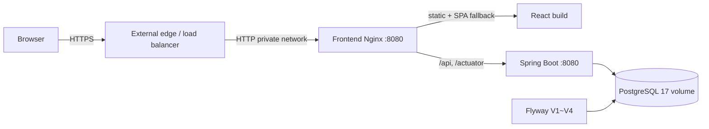

# 배포 준비

## 범위와 현재 상태

이 문서는 특정 클라우드 사업자에 종속되지 않는 CalTalk production container 구성을 설명합니다. Docker image와 로컬 production smoke가 검증 대상이며, 실제 도메인·TLS 인증서·관리형 DB·자동 backup·CI/CD는 아직 구성되지 않았습니다.

## 배포 아키텍처



외부 edge가 HTTPS를 종료하고 frontend container로 전달하는 same-origin 구성을 기본으로 합니다. Browser에는 frontend port만 공개하며 backend와 PostgreSQL은 Docker network 내부에 둡니다. Frontend Nginx는 `/api`와 `/actuator`를 backend로 proxy합니다.

Redis는 현재 session 또는 domain 저장 경로에서 사용하지 않으므로 production compose에 포함하지 않습니다. 현재 session 저장소는 PostgreSQL 기반 Spring Session JDBC입니다. Production profile에서는 사용하지 않는 Redis health contributor를 비활성화하고 PostgreSQL을 필수 dependency health로 유지합니다.

## Container image

### Backend

`backend/Dockerfile`은 Java 21 Alpine multi-stage build입니다.

- Gradle wrapper로 compileTestJava와 executable bootJar 생성
- runtime에는 JRE와 application jar만 복사
- non-root `caltalk` 사용자
- `/actuator/health` image healthcheck
- JVM memory는 `JAVA_TOOL_OPTIONS`로 외부 주입

Testcontainers 기반 전체 backend test는 image build 전에 별도 검증합니다. Docker build 환경에는 Docker daemon이 제공된다고 가정하지 않으므로 image 단계에서 테스트를 생략하는 flag를 사용하지 않고, 필요한 compile과 package task만 명시적으로 실행합니다.

### Frontend

`frontend/Dockerfile`은 Node build와 unprivileged Nginx runtime의 multi-stage build입니다.

- `npm ci`
- `npm run build`
- runtime에는 `dist`만 복사
- Vite dev server와 node_modules를 runtime에서 사용하지 않음
- non-root Nginx user
- `/healthz` healthcheck
- SPA history fallback
- hashed asset 장기 cache와 HTML no-cache
- Vite source map은 기본적으로 생성하지 않음

## Environment variables

### Backend

| 변수 | 설명 | Production |
|---|---|---|
| `SPRING_PROFILES_ACTIVE` | Spring profile | `prod` |
| `DB_URL` | PostgreSQL JDBC URL | compose가 내부 hostname으로 구성 |
| `DB_USERNAME` | DB 사용자 | 외부 주입 |
| `DB_PASSWORD` | DB 인증값 | 필수 외부 주입 |
| `CORS_ALLOWED_ORIGINS` | 쉼표로 구분한 정확한 HTTP(S) origin | 필수 외부 주입 |
| `SESSION_COOKIE_SECURE` | session·CSRF cookie Secure 속성 | 기본 `true` |
| `JAVA_TOOL_OPTIONS` | container JVM memory option | 기본 RAM 75% |
| `SERVER_PORT` | Spring Boot port override | 필요 시 사용, 기본 8080 |

Production profile은 schema validate, Flyway, Spring Session schema 자동 초기화 금지, graceful shutdown, forwarded header 처리와 error detail 비노출을 설정합니다. Actuator는 health만 공개하며 상세 정보는 숨깁니다.

### Frontend

| 변수 | 시점 | 설명 |
|---|---|---|
| `VITE_API_BASE_URL` | build time | API origin. 빈 값이면 same-origin |

Vite 환경 변수는 runtime 설정이 아니라 build 결과에 포함됩니다. 이 compose는 same-origin이므로 빈 값으로 build합니다. 별도 API origin을 사용하려면 정확한 HTTPS URL로 image를 다시 build하고 cookie SameSite, credentials, CORS와 CSRF를 함께 검증해야 합니다.

## CORS

개발 기본값은 `http://localhost:5173`입니다. Production에서는 `CORS_ALLOWED_ORIGINS`를 반드시 전달합니다.

- 쉼표로 여러 origin 지정 가능
- 공백 제거와 중복 제거
- `http` 또는 `https`의 정확한 origin만 허용
- wildcard, path, query, fragment, user info와 malformed 값은 startup 시 거부
- credentials, method와 header 허용 계약은 기존 정책 유지

Same-origin browser 요청에는 CORS가 적용되지 않지만, 허용할 production origin은 명시적으로 설정해 예상하지 않은 cross-origin 접근을 차단합니다.

## HTTPS, cookie와 proxy

Production에서는 HTTPS가 필수입니다.

- `SESSION_COOKIE_SECURE=true`
- `CALTALK_SESSION`: HttpOnly, Secure, SameSite=Lax, Path=/
- `XSRF-TOKEN`: JavaScript readable, Secure, SameSite=Lax, Path=/
- 외부 edge는 `X-Forwarded-Proto=https`를 전달
- frontend Nginx는 forwarded host, proto와 client chain을 backend에 전달
- backend는 `server.forward-headers-strategy=framework`로 처리

현재 container 자체는 TLS 인증서를 관리하지 않습니다. 실제 환경에서는 신뢰할 수 있는 edge 또는 load balancer에서 HTTPS를 종료하고 private network로 frontend에 전달해야 합니다.

## Build와 실행

예시 파일을 실제 secret이 없는 별도 `.env.prod`로 복사한 뒤 placeholder를 교체합니다. `.env.prod`는 Git에 추가하지 않습니다.

```powershell
Copy-Item infra\.env.prod.example infra\.env.prod
# infra/.env.prod의 placeholder와 production origin을 안전한 값으로 교체

docker compose `
  --env-file infra/.env.prod `
  -f infra/compose.prod.yaml `
  config

docker compose `
  --env-file infra/.env.prod `
  -f infra/compose.prod.yaml `
  build

docker compose `
  --env-file infra/.env.prod `
  -f infra/compose.prod.yaml `
  up -d --wait
```

기본 frontend 접근 주소는 `http://localhost:8088`입니다. 이는 TLS edge가 없는 로컬 smoke 주소이며 production 공개 URL이 아닙니다.

## Health와 readiness

- Frontend: `/healthz`
- Backend application: `/api/v1/health`
- Backend dependency health: `/actuator/health`
- PostgreSQL: `pg_isready`

Compose는 PostgreSQL health 후 backend, backend health 후 frontend를 시작합니다. `/actuator/health`는 DB 장애 시 unhealthy 상태를 반환하므로 container readiness에도 반영됩니다.

Smoke 확인 항목:

- `/healthz` 200
- `/` 200과 정적 asset 제공
- `/login` SPA fallback 200
- `/actuator/health` proxy 응답
- Flyway migration 완료
- 실제 회원가입·로그인·CSRF·일정 생성·로그아웃

## 종료

```powershell
docker compose `
  --env-file infra/.env.prod `
  -f infra/compose.prod.yaml `
  down
```

`down`은 named PostgreSQL volume을 보존합니다. 데이터 삭제가 명시적으로 필요하지 않다면 `down -v`를 사용하지 않습니다.

## Backup과 rollback

- PostgreSQL named volume은 container 교체 뒤에도 데이터를 보존하지만 backup을 대신하지 않습니다.
- 현재 자동 backup과 restore drill은 구현되지 않았습니다.
- 운영 전 `pg_dump` 또는 관리형 DB snapshot 정책, 암호화, 보존 기간과 복구 목표를 정해야 합니다.
- Flyway migration은 forward-only로 관리하며 이미 적용된 migration 파일을 수정하지 않습니다.
- application image rollback 전에 새 migration과 이전 application의 호환성을 검토해야 합니다.
- destructive migration은 expand/contract 방식과 검증된 backup 없이는 배포하지 않습니다.
- zero-downtime와 DB rollback을 보장하지 않습니다.

## 배포 전 체크리스트

- 실제 secret을 secret manager 또는 platform 환경 변수로 주입
- HTTPS와 인증서 갱신 확인
- `SESSION_COOKIE_SECURE=true`
- production CORS origin 확인
- DB public port 비노출 확인
- image tag를 배포 artifact 또는 commit으로 고정
- backend/frontend test와 image build 성공 확인
- migration backup·호환성 검토
- health/readiness와 graceful shutdown 확인
- monitoring, alerting, backup/recovery와 rollback runbook 준비

## 남은 운영 과제

- 실제 cloud/hosting 선택과 배포 URL
- TLS edge와 certificate automation
- CI/CD와 image registry
- monitoring, alerting, centralized logging
- PostgreSQL 자동 backup과 restore drill
- rate limiting과 로그인 시도 제한
- resource limit과 production 부하 측정
