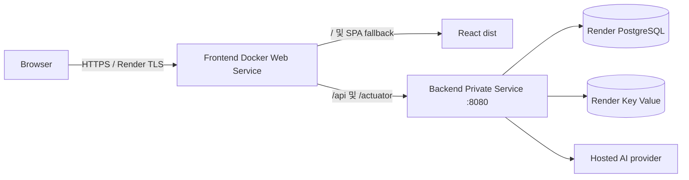

# Render 배포 가이드

## 상태와 아키텍처

이 저장소는 Render 배포 설정과 로컬 검증 경로만 준비합니다. 실제 Render 리소스, custom domain, Route 53 record와 외부 TLS 검증은 아직 완료되지 않았습니다.



Frontend, backend, database와 Key Value는 같은 workspace와 `singapore` region에 둡니다. Browser에는 frontend만 공개하고 custom domain도 frontend에만 연결합니다. Backend는 public URL이 없는 Private Service가 기본입니다. 카카오 스킬 URL은 공개 frontend origin의 `/api/v1/kakao/skill`을 사용하며 Nginx가 private backend로 전달합니다.

## Blueprint 배포

저장소 루트의 `render.yaml`은 frontend Web Service, backend Private Service와 managed PostgreSQL을 생성합니다. Render Dashboard에서 New > Blueprint로 저장소를 연결한 뒤 생성 화면에서 `sync: false`인 값을 입력합니다.

- `DB_URL`: `jdbc:postgresql://<internal-host>:5432/<database>`
- `CORS_ALLOWED_ORIGINS`: `https://caltalk.<메인도메인>` 형태의 exact origin
- `REDIS_URL`: Blueprint가 `caltalk-redis`의 internal connection string으로 자동 연결

`DB_USERNAME`과 `DB_PASSWORD`는 database property reference로, frontend의 `BACKEND_ORIGIN`은 backend `hostport` reference로 연결됩니다. Blueprint는 문자열 보간을 지원하지 않고 PostgreSQL `connectionString`은 `postgresql://` 형식이므로 JDBC prefix가 필요한 `DB_URL`은 수동 입력합니다. 기존 Blueprint를 갱신할 때 새 `sync: false` 항목은 자동 prompt되지 않으므로 Dashboard에서 직접 추가합니다.

Plan 가격과 무료 정책은 변경될 수 있습니다. 적용 전에 Dashboard에서 최신 plan, region 지원, 비용과 database 만료/backup 정책을 확인해 `render.yaml`의 plan을 조정합니다. Private Service에는 free plan을 사용할 수 없습니다.

## Dashboard 수동 설정 대안

1. 같은 region에 Render PostgreSQL을 만들고 외부 inbound access를 차단합니다.
2. `backend` root directory의 Docker Private Service를 만들고 port 8080으로 실행합니다.
3. 아래 backend 환경 변수를 설정하고 `/actuator/health`를 확인합니다.
4. `frontend` root directory의 Docker Web Service를 만들고 health check path를 `/healthz`로 설정합니다.
5. Backend의 Connect > Internal에 표시되는 Service Address를 frontend `BACKEND_ORIGIN`에 `http://<host>:8080`으로 설정합니다.

Private Service가 계정/plan 제약으로 불가능한 경우에만 backend를 Web Service로 만들되 custom domain은 연결하지 않고, frontend는 backend의 private address로 통신합니다. 공개 backend URL을 browser API base로 사용하지 않습니다.

## 환경 변수

### Backend Private Service

| 변수 | 값 |
|---|---|
| `PORT` | `8080` |
| `SPRING_PROFILES_ACTIVE` | `prod` |
| `DB_URL` | `jdbc:postgresql://<internal-host>:5432/<database>` |
| `DB_USERNAME` | Render PostgreSQL user |
| `DB_PASSWORD` | Render PostgreSQL password |
| `REDIS_URL` | Render Key Value internal connection string |
| `SESSION_COOKIE_SECURE` | `true` |
| `CORS_ALLOWED_ORIGINS` | `https://caltalk.<메인도메인>` |
| `JAVA_TOOL_OPTIONS` | `-XX:MaxRAMPercentage=75.0` |

카카오 챗봇 운영에는 `KAKAO_CHATBOT_ENABLED=true`, 기존 스킬 헤더와 같은
`KAKAO_CHATBOT_SKILL_SECRET`, 고정된 `KAKAO_IDENTITY_HMAC_SECRET`이 필요합니다.
자연어 처리에는 아래 AI 운영 방식을 먼저 결정해야 합니다.

- Render의 일반 CPU 서비스는 로컬 PC의 Ollama/RTX에 접근하지 못합니다.
- Ollama 우선 정책을 운영에서도 유지하려면 인증된 별도 GPU Ollama endpoint가 필요합니다.
- GPU endpoint 준비 전 임시 운영은 OpenAI fallback을 주 공급자로 사용할 수 있지만,
  이는 로컬 Ollama 우선이라는 목표 구조의 임시 예외로 명시해야 합니다.
- PC의 Ollama를 임시 터널로 노출하면 PC 의존성과 보안 위험이 남으므로 운영 구성으로 사용하지 않습니다.

Backend는 localhost에 고정 바인딩하지 않고 `server.port=${PORT:8080}`을 사용합니다. Render private network는 port 10000을 예약하므로 backend는 8080을 명시합니다. Flyway V1~V4는 application startup에서 한 번 실행하며 별도 pre-deploy migration을 구성하지 않습니다.

### Frontend Web Service

| 변수 | 값 |
|---|---|
| `PORT` | Render가 runtime에 자동 제공; 수동 설정 불필요 |
| `BACKEND_ORIGIN` | backend `hostport` 참조 또는 `http://<private-host>:8080` |
| `VITE_API_BASE_URL` | 빈 값(기본값, build time) |

Startup은 `PORT`와 `BACKEND_ORIGIN`만 Nginx template에 치환합니다. `host:port`만 전달되면 `http://`를 붙이고 다른 protocol은 거부합니다. `proxy_pass` 뒤에 URI를 붙이지 않아 `/api/v1/...`와 `/actuator/...` 경로가 그대로 전달됩니다.

## Same-origin, cookie와 CSRF

Browser 요청은 frontend origin의 `/api`와 `/actuator`를 사용합니다. Nginx는 Host와 forwarded header를 전달하며 cookie와 `X-XSRF-TOKEN`을 변경하지 않습니다. Production session cookie와 JavaScript-readable CSRF cookie는 Secure, SameSite=Lax, Path=/입니다. CSRF는 활성 상태이며 CORS는 wildcard가 아닌 exact origin만 허용합니다.

## Custom domain과 Route 53

1. Frontend 배포와 `/healthz` 성공을 먼저 확인합니다.
2. Frontend Settings > Custom Domains에 `caltalk.<메인도메인>`을 추가하고 DNS target을 확인합니다.
3. 메인 도메인의 기존 Route 53 Public Hosted Zone에서 같은 이름의 A/AAAA/CNAME 충돌이 없는지 확인합니다.
4. name `caltalk`, type `CNAME`, Alias Off, value는 Render frontend hostname, TTL 300(또는 기본값)으로 추가합니다.
5. Render에서 Verify 후 managed TLS 발급 완료를 확인합니다.

값에는 `https://`나 URL path를 넣지 않습니다. apex/www record를 수정하거나 별도 subdomain hosted zone, Alias, 고정 IP A record를 만들지 않습니다.

```powershell
Resolve-DnsName caltalk.<메인도메인>
curl.exe -I https://caltalk.<메인도메인>
curl.exe https://caltalk.<메인도메인>/healthz
```

## Smoke, rollback과 운영

배포 후 `/healthz`, `/`, `/login`, `/api/v1/health`, `/actuator/health`, 회원가입·로그인, CSRF 변경 요청과 로그아웃을 확인합니다. Browser network의 API 요청이 frontend origin만 사용하는지도 확인합니다.

Application rollback은 Render Deploys에서 직전 정상 deploy를 선택합니다. Flyway는 forward-only이므로 이전 application과 적용된 schema의 호환성을 먼저 확인합니다. Database backup/snapshot 보존과 restore를 운영 전에 검증합니다. DB password 회전 시 backend 환경 변수가 새 credential을 가리키는지 확인하고 재배포한 뒤 기존 credential을 폐기합니다.

남은 운영 작업은 실제 Blueprint 생성과 비용 결정, domain/Route 53/TLS 적용, monitoring·alerting·log 보존, backup/restore drill, instance sizing과 rollback rehearsal입니다.
