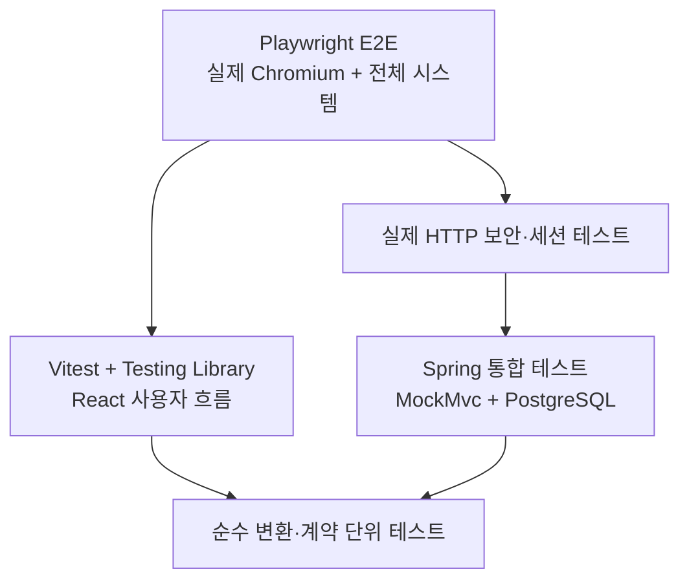

# 테스트 전략

## 1. 목표

CalTalk은 단위 테스트만으로 통과 여부를 판단하지 않습니다. 도메인 규칙, 실제 PostgreSQL 동작, HTTP 보안 계약, React 사용자 흐름과 실제 브라우저 통합을 서로 다른 계층에서 검증합니다.

기준 커밋 `d20e928`의 현재 결과는 다음과 같습니다.

| 계층 | 결과 |
|---|---:|
| Backend integration | 96 / 96, 17 suites |
| Frontend unit/component | 30 / 30, 4 files |
| Playwright browser E2E | 5 / 5 |
| npm audit | 0 vulnerabilities |

Backend warning-mode compile과 frontend format, lint, typecheck, build도 성공했습니다.

## 2. 테스트 계층



각 계층의 책임을 겹치게 만들지 않습니다. 예를 들어 브라우저 E2E는 실제 승인 UI를 검증하고, 동시에 발생하는 confirmation 경쟁은 재현성을 위해 backend의 `CountDownLatch` 통합 테스트가 담당합니다.

## 3. Backend integration tests

Spring Security filter부터 Controller, Service, Repository와 PostgreSQL까지 연결합니다.

- PostgreSQL 17 Testcontainers
- production Flyway V1~V4 그대로 적용
- Hibernate `ddl-auto=validate`
- H2 미사용
- 회원가입, 로그인, 로그아웃, 사용자 조회·수정·탈퇴
- 일정 CRUD, 소유권 은닉, optimistic locking, 변경 이력
- strict JSON과 401·403·404·409·422 오류 계약
- Spring Session JDBC 저장·복원·삭제
- confirmation 발급·만료·승인·교체

HTTP 응답뿐 아니라 DB 상태, 이력, confirmation 상태와 부분 커밋 여부를 함께 검증합니다.

## 4. Frontend unit/component tests

Vitest, JSDOM, Testing Library와 user-event를 사용합니다.

- 인증 route guard와 session restore
- 로그인·로그아웃 사용자 흐름
- API client의 credentials와 CSRF bootstrap
- 일정 목록·상세·생성·수정·삭제
- location KEEP·SET·REMOVE 요청 계약
- 409 conflict dialog와 confirmation 승인
- stale confirmation의 replacement ID 반영
- TanStack Query invalidate와 상세 query 활성 조건
- UTC와 사용자 time zone 변환
- DST gap 거부와 DST overlap의 earlier-instant 정책
- loading, empty, error 상태

Vitest는 `src/**/*.test.{ts,tsx}`만 수집해 Playwright 스위트와 분리합니다.

## 5. Browser E2E

Playwright는 mock backend나 route interception 없이 실제 시스템을 구동합니다.

- Docker Compose PostgreSQL 17과 Redis 7.4
- 실제 Flyway migration과 Spring Boot backend
- 실제 Vite frontend
- 실제 Chromium
- `http://localhost:5173` origin
- PostgreSQL 55432, Redis 56379, backend 8080, frontend 5173

검증 시나리오:

1. 회원가입, 중복 이메일, 정상·실패 로그인
2. 새로고침 후 Spring Session JDBC 인증 복원
3. `CALTALK_SESSION`의 HttpOnly·Secure·SameSite 속성
4. `XSRF-TOKEN` 발급과 frontend의 `X-XSRF-TOKEN` 전달
5. CSRF header 누락 요청의 `403` JSON
6. 일정 생성·상세·수정·삭제와 location KEEP·SET·REMOVE
7. 사용자 time zone 변경과 일정 UTC 값 불변
8. CREATE_EVENT·UPDATE_EVENT 충돌 UI와 승인
9. 로그아웃 후 기존 session 재사용 `401`과 보호 경로 차단

E2E는 매 실행마다 UUID와 timestamp 기반 고유 이메일·일정 제목을 사용합니다. DB에 직접 데이터를 삽입하지 않으며, 실제 브라우저 session과 CSRF를 사용한 회원 탈퇴로 데이터를 정리합니다.

고정 sleep, `page.waitForTimeout`, `test.skip`, `test.only`를 사용하지 않습니다. locator는 label, role과 접근 가능한 이름을 우선합니다.

## 6. 동시성 테스트

confirmation 경쟁은 backend 통합 테스트에서 실제 PostgreSQL 제약과 transaction을 사용해 결정적으로 검증합니다.

- 부분 유니크 인덱스
- `ON CONFLICT DO NOTHING RETURNING`
- PENDING 행 비관적 잠금
- 최초 CREATE 경쟁의 동일 ID 수렴
- stale CREATE·UPDATE의 `SUPERSEDED`
- replacement PENDING 한 개 유지
- 두 요청의 최신 confirmation ID 수렴
- 500과 일정·이력 부분 커밋 없음

동시 시작은 `CountDownLatch`를 사용하며 `Thread.sleep`은 사용하지 않습니다.

## 7. 보안 테스트

- BCrypt password hash
- 로그인 성공 시 session ID 교체
- Spring Session JDBC 인증 복원
- 로그아웃·회원 탈퇴의 현재 session 제거
- 실제 HTTP cookie jar 기반 CSRF
- CORS preflight와 임의 origin 차단
- session principal 기반 소유권과 다른 사용자 자원 404
- strict JSON unknown field의 `422 UNKNOWN_FIELD`
- 오류 응답의 password·token·session ID·stack trace 비반사

Playwright fixture는 처리되지 않은 브라우저 런타임 예외인 `pageerror`를 수집하며 현재 결과는 0입니다. 의도적으로 발생시키는 401·403·409 HTTP 응답은 브라우저 resource 메시지가 될 수 있으므로 console 메시지 전체가 없었다고 주장하지 않습니다.

## 8. 시간대 테스트

- server·DB UTC `Instant`
- 사용자 IANA time zone 기준 입출력
- 잘못된 날짜와 time zone 거부
- DST gap 거부
- DST overlap은 더 이른 instant 선택
- time zone 변경 후 API UTC 값 유지

## 9. 테스트 데이터 전략

- Backend는 각 테스트 transaction 또는 명시적 repository 정리 사용
- E2E는 테스트별 고유 이메일과 일정 제목 사용
- 테스트 순서에 의존하지 않음
- E2E cleanup은 실제 회원 탈퇴 API 사용
- 비밀번호, cookie 전체 값, CSRF token과 session ID를 출력하지 않음
- Playwright trace, screenshot, video와 report는 Git 제외

## 10. 실행 명령

Backend:

```powershell
cd backend
.\gradlew.bat clean test --console=plain
.\gradlew.bat compileTestJava --warning-mode all --console=plain
```

Frontend:

```powershell
cd frontend
npm audit
npm run format:check
npm run lint
npm run typecheck
npm run test -- --run
npm run build
```

Browser E2E:

```powershell
cd frontend
npm run e2e:install
npm run e2e
```

## 11. 현재 결과

- Backend 96개, 실패·오류·건너뜀 0
- Frontend 30개, 실패 0
- Playwright E2E 5개, 실패 0
- Uncaught browser pageerror 0
- npm audit 0 vulnerabilities
- deprecated compile warning 없음
- E2E 종료 후 backend·frontend·이번 실행이 시작한 Compose service 정리

## 12. 제한사항

- 운영 HTTPS, reverse proxy, Secure cookie와 운영 CORS는 배포 환경에서 재검증해야 합니다.
- 실제 배포 환경의 부하·장시간 session cleanup 테스트는 포함하지 않습니다.
- browser E2E는 사용자 핵심 흐름을 담당하며 모든 backend 동시 경쟁을 UI에서 중복 재현하지 않습니다.
- CI/CD가 아직 구성되지 않아 현재 명령은 로컬에서 실행합니다.
